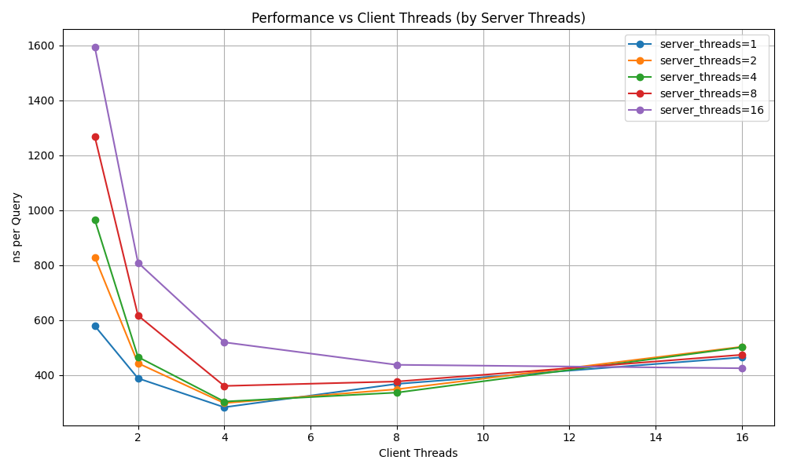

## Overview

This project implements a high-performance client–server key–value store using POSIX shared memory for interprocess communication. Clients submit requests by writing tasks into a shared memory region, which are then processed by a pool of server worker threads. The design focuses on minimizing synchronization overhead and maximizing throughput by using lock-free data structures and communicating over shared memory.

Shared memory is used only to exchange tasks and results, while the hashmap itself remains local to the server process. This allows the server to operate on in-memory data efficiently while still supporting concurrent access from multiple clients.

## Design

### Server Workflow
- Create the shared memory region.
- Initialize the task queue and block allocator inside shared memory.
- Initialize the in-memory hashmap with the configured number of buckets.
- Spawn a pool of worker threads.

Worker threads repeatedly:
- Pop a block ID from the task queue.
- Retrieve the corresponding Task from the block allocator.
- Execute the requested operation on the hashmap (`GET`, `PUT`, `INSERT`, `UPDATE`, `DELETE`, `READ_BUCKET`).
- Update the task status to signal completion (`DONE` or `FAIL`).
- Workers continue processing tasks until the server stops and joins all threads.

### Client Workflow
- Attach to the existing shared memory region created by the server.

For each request:
- Allocate a block from the block allocator.
- Fill the block’s Task structure (operation type and entry data).
- Set the task status to `SUBMITTED`.
- Push the block ID into the task queue.
- Wait until the server updates the task status.
- Read the result and return the block to the allocator.

### Exception: Read Bucket Task
`READ_BUCKET` may return multiple entries.

- The server iterates through the selected bucket and sends entries one at a time.
- For each entry, the server writes the data into the task and sets the status to `WAITING`.
- The client reads the entry and sets the status back to `SUBMITTED` to continue.
- After the last entry, the server sets the status to `DONE`.

## Components

### SharedMemory

The `SharedMemory` component manages the POSIX shared memory region used for communication between client and server.

Layout of shared memory region:

- SharedData (metadata)
- TaskQueue
- BlockAllocator

It provides `init` function for server and `attach` for clients. They work as wrappers for `shm_open`, `ftruncate` and `mmap`.

The shared memory is only used for communication and does not contain the hash map itself, which remains local to the server process.

### TaskQueue
The `TaskQueue` component implements a bounded multi-producer multi-consumer (MPMC) queue used to transfer tasks from clients to server workers.

Each slot stores a sequence number and a block ID referring to a task in the block allocator. Clients push block IDs into the queue, while server workers pop them for execution.

The implementation follows Dmitry Vyukov’s lock-free bounded MPMC queue algorithm, where sequence numbers ensure correct synchronization between producers and consumers.

### BlockAllocator
The `BlockAllocator` provides a lock-free memory pool inside shared memory for storing tasks.

Memory is divided into a fixed number of blocks. Clients allocate a block to store a task and return it to the allocator after the request is completed.

Free blocks are managed using a lock-free stack implemented with atomic operations. To prevent the ABA problem, the allocator stores a version tag together with the head pointer and updates it on every modification.

### Task Structure
Each client request is represented by a `Task` stored inside a block allocated from the block allocator.

A task contains:
- a status field used for synchronization between client and server
- a type specifying the requested operation
- a payload containing the entry data or additional parameters

The client initializes the task and sets its status to `SUBMITTED`. After processing the request, the server updates the status to indicate completion and make the result available to the client.

### Hashmap
The server maintains an in-memory bucketed hash map that stores key–value pairs.

The table consists of multiple buckets, each containing a linked list of entries and protected by a readers-writer lock (shared_mutex).

- Read operations acquire a shared lock
- Write operations acquire an exclusive lock

Collisions are handled using separate chaining, where entries with the same hash bucket are stored in a linked list.

## Assumptions
The system makes the following assumptions:
- Keys and values are strings and fit within the fixed-size task blocks used for communication.
- Shared memory is used only for communication between clients and the server. The hash map itself is stored entirely in the server’s private memory.
- Clients and server run on the same machine, since POSIX shared memory is used for interprocess communication.
- The queue capacity and block count are fixed at initialization time.

## Design Choices and Tradeoffs

| Component / Feature           | Implementation                                 | Reason / Tradeoff                                                                                                |
|-------------------------------|------------------------------------------------|------------------------------------------------------------------------------------------------------------------|
| **TaskQueue**                 | Lock-free MPMC queue (Vyukov)                  | Minimizes synchronization overhead but it harder to implement than a mutex-based queue                           |
| **BlockAllocator**            | Fixed-size blocks with ABA-protected free list | Avoids dynamic allocations per request and blocks can be reused efficiently but limits payload size              |
| **HashMap**                   | Chained buckets with shared_mutex              | Simple design with good performance but can slow down if low amount of buckets are used                          |
| **Fixed block & queue sizes** | Preallocated sizes at startup                  | Reduces runtime allocation overhead but can waste memory if expected payloads are small and limits payload sizes |

## Benchmarks and Evaluation

### Baseline: Direct Hashmap Access (No IPC)
This benchmark measures the raw performance of the hashmap under multithreaded access without any inter-process communication overhead.

| Threads    | Time per Operation (ns/op) |
|------------|----------------------------|
| 1 thread   | 176.357 ns                 |
| 2 threads  | 160.659 ns                 |
| 4 threads  | 86.8792 ns                 |
| 8 threads  | 67.8497 ns                 |
| 16 threads | 48.7123 ns                 |

Interpretation:
- Throughput improves significantly with more threads (ns/op decreases).
- At 16 threads, performance is ~3.6× better than single-threaded.
- This represents the upper bound of system performance without IPC overhead.

### IPC via Shared Memory
This benchmark includes the full pipeline.
```
client -> allocate block -> write task data -> task queue -> server -> change status -> client -> free block
```


*lower values are better

**Throughput vs Overhead:**
- Baseline best: ~49 ns/op
- IPC best: ~282 ns/op

This corresponds to roughly a 5–6x throughput reduction due to inter-process synchronization.

**Scaling Behavior:**

Increasing client threads improves throughput up to a point (4–8 clients). Beyond that, contention dominates and ns/op increases.

**Server Thread Utilization:**

More server threads in general do not improve throughput. With few clients, extra server threads introduce overhead (busy-waiting, contention).

This is because each request is very cheap to process, so a single server thread can already keep up with clients. The real bottleneck is synchronization (clients waiting on shared memory and cache coherence). Adding more server threads only increases contention without reducing this cost, so it does not improve performance.

## Conclusion

Benchmark results show that while the hashmap itself scales well, overall system performance is dominated by synchronization and communication overhead. In particular, a single server thread is often sufficient, as the main bottleneck lies in client-side waiting and shared memory coordination rather than computation. This highlights the tradeoff between process isolation and performance when using shared-memory IPC.